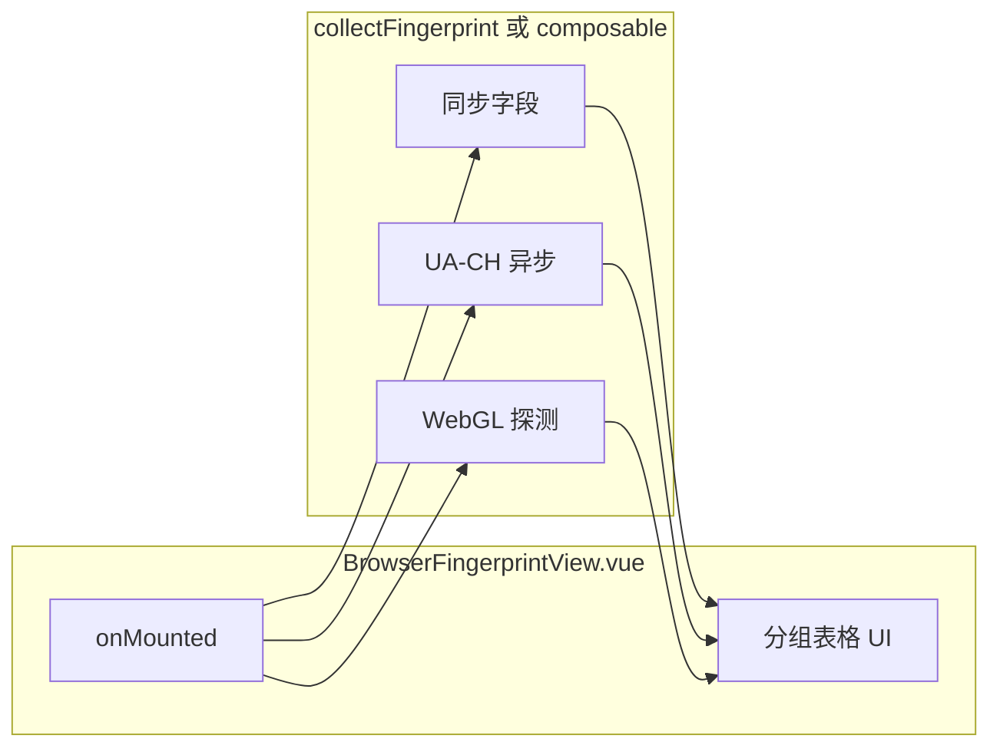

# 小工具：浏览器指纹查看

**日期**：2026-03-26  
**类型**：功能

## 改动说明

- 新增采集逻辑 [`src/utils/browserFingerprint.ts`](../../src/utils/browserFingerprint.ts)：`collectBrowserFingerprint`、`formatDisplayValue`、Navigator / UA-CH 高熵、屏幕与 `visualViewport`、时区与 `Intl`、存储与 `matchMedia`、WebGL 供应商与渲染器。
- 新增页面 [`src/views/tools/BrowserFingerprintView.vue`](../../src/views/tools/BrowserFingerprintView.vue)：分组 `<dl>` 展示、加载与错误提示、「复制全部（JSON）」。
- 在 [`src/tools/tools.ts`](../../src/tools/tools.ts) 注册 `/browser-fingerprint`，标题「浏览器指纹查看」，标签便于首页搜索。
- 单测 [`src/utils/__tests__/browserFingerprint.spec.ts`](../../src/utils/__tests__/browserFingerprint.spec.ts) 覆盖 `formatDisplayValue`。
- 计划归档：根目录 [`PLAN.md`](../../PLAN.md)、[`ai/guides/browser-fingerprint-viewer-plan.md`](../guides/browser-fingerprint-viewer-plan.md)（与 `PLAN.md` 同文）。

## 任务与计划记录

详见 [`guides/dev-tasks.md`](../guides/dev-tasks.md) 中「里程碑：浏览器指纹查看器」。

## 实现计划（全文）

以下与仓库根目录 [`PLAN.md`](../../PLAN.md) 及 [`guides/browser-fingerprint-viewer-plan.md`](../guides/browser-fingerprint-viewer-plan.md) 正文一致（链接已按本文件所在目录调整）。

---

# 浏览器指纹查看器 — 实现计划

## 背景与目标

- **目标**：用户打开页面即可看到当前浏览器环境下可读取的指纹相关信息，便于自查、调试或与隐私扩展对比。
- **约束**：与现有架构一致（[`src/tools/tools.ts`](../../src/tools/tools.ts) 注册、[`src/router/index.ts`](../../src/router/index.ts) 自动展开路由）；沿用 [`src/App.vue`](../../src/App.vue) 顶栏与 [CSS 变量](../../src/assets/base.css)（`--color-*`）；**不新增 npm 依赖**，采集逻辑用原生 Web API + 少量 TypeScript。

## 功能范围（第一期）

按**分组 + 键值表**展示，每项包含「标签 / 原始值」；长文本（如完整 `userAgent`）可折行或等宽块显示。

| 分组 | 建议字段（实现时以实际可用性为准，缺失标「不可用」） |
| --- | --- |
| **Navigator** | `userAgent`、`userAgentData`（Chromium：`brands`、`mobile`、`platform` 等，需 `navigator.userAgentData?.getHighEntropyValues?.()` 可选请求 `architecture`、`bitness`、`model`、`platformVersion`、`uaFullVersion` 等——注意为异步且可能拒绝）、`language` / `languages`、`platform`、`cookieEnabled`、`hardwareConcurrency`、`deviceMemory`、`maxTouchPoints`、`webdriver` |
| **屏幕与视口** | `screen.width/height`、`availWidth/availHeight`、`colorDepth`、`pixelDepth`、`devicePixelRatio`、`window.innerWidth/innerHeight`、`VisualViewport`（若存在） |
| **时区与区域** | `Intl.DateTimeFormat().resolvedOptions().timeZone`、`Date` 与 `toLocaleString` 示例（可选）、`resolvedOptions().locale` |
| **特性探测（布尔/字符串）** | `localStorage` / `sessionStorage` / `indexedDB` 可用性（try/catch）、`matchMedia('(prefers-color-scheme: dark)')` 等 1～2 个常见 media query |
| **WebGL** | 创建 `canvas.getContext('webgl')` 或 `webgl2`，读取 `UNMASKED_VENDOR_WEBGL` / `UNMASKED_RENDERER_WEBGL`；失败则显示原因 |

**明确不做（第一期）**：Canvas 图像哈希、AudioContext 指纹、字体枚举等「强指纹 / 高成本」能力——若后续需要，可作为独立「高级」折叠区并加醒目隐私说明。

## 架构与数据流

- 推荐将采集逻辑抽到 **`src/utils/browserFingerprint.ts`**（或 `src/composables/useBrowserFingerprint.ts`）：导出类型如 `FingerprintSection { title: string; rows: { label: string; value: string }[] }[]`，便于单测与视图保持单薄。
- 视图 **`src/views/tools/BrowserFingerprintView.vue`**：`onMounted` 调用采集函数，`ref` 存结果；加载中简短提示；错误行内展示。

## 注册与可发现性

- 在 [`src/tools/tools.ts`](../../src/tools/tools.ts) 增加一项（建议插在 `face-loading-ring` 与 `about` 之间，避免「关于」被淹没）：
  - `name`: `browser-fingerprint`
  - `path`: `/browser-fingerprint`
  - `title`: `浏览器指纹查看`
  - `description` / `tags`: 覆盖「指纹」「User-Agent」「WebGL」「屏幕」「隐私」等便于 [`filterTools`](../../src/tools/filterTools.ts) 搜索。

## UI / UX 要点

- 布局参考 [`PlaceholderToolView.vue`](../../src/views/tools/PlaceholderToolView.vue)：主内容 `max-width` 约 40～48rem、`padding` 与标题层级与现有工具一致。
- 每组 `<section>` + `<h2>`，表格用 `<dl>` 两列或 `<table>`，值列使用 `word-break` / `overflow-wrap` 防止撑破布局。
- **页首简短说明**：数据均在本机页面内读取与展示，不上传服务器（与项目纯静态站点一致）。
- **可选**：「复制全部 JSON」或「复制某组」按钮（`navigator.clipboard.writeText`），失败时降级提示。

## 测试与质量

- 若 `browserFingerprint.ts` 内含纯函数（例如格式化 `userAgentData`、合并 sections），可在 **`src/utils/__tests__/browserFingerprint.spec.ts`** 用 Vitest 测边界（mock 最小 `Navigator` 不现实时可只测格式化函数）。
- 实现完成后执行：`pnpm run type-check`、`pnpm exec vitest run`（与 [`ai/guides/dev-tasks.md`](../guides/dev-tasks.md) 约定一致）。

## 文档与归档（实现阶段）

- 按仓库规则：在 **`ai/changelog/`** 新增当日条目（如 `2026-03-26-browser-fingerprint-viewer.md`），链接到 `BrowserFingerprintView.vue`、`tools.ts`、若有则 `browserFingerprint.ts`。
- **完整 `PLAN.md` 必须落入仓库「记录」**（与代码改动同一提交或紧随其后的提交中完成），满足可追溯、单文件可读的归档要求：
  1. **根目录 [`PLAN.md`](../../PLAN.md)**：写入**完整**实现计划正文（与定稿时的本计划一致：含背景、范围表、架构图 mermaid、注册项、UI/测试/风险、交付物等；frontmatter 可省略或保留最小 YAML，以可读性为准）。
  2. **[`ai/guides/browser-fingerprint-viewer-plan.md`](../guides/browser-fingerprint-viewer-plan.md)**：与根目录 `PLAN.md` **内容相同**（长期有效的计划快照，符合 `ai/guides` 用途）。
  3. **当日 changelog 条目**：除改动列表与相对链接外，须**完整收录**计划正文——在 changelog 中增加章节「实现计划（全文）」，将上述 `PLAN.md` 的 Markdown **全文粘贴**（与根目录、`ai/guides` 中版本一致），避免仅写「见 PLAN.md」而无正文导致单文件不完整。
- 可选：在 [`ai/guides/dev-tasks.md`](../guides/dev-tasks.md) 增加一小节里程碑勾选（与摄像头镜子条目同风格）。

## 风险与说明

- **Client Hints**：`getHighEntropyValues` 仅在部分 Chromium 系可用，且可能返回空或抛错；需 try/catch，UI 标明「不支持或已拒绝」。
- **WebGL**：部分环境禁用或返回通用 renderer；属正常现象。
- **隐私**：本工具用于**展示**已有信号，不主动强化指纹；避免在第一期默认做 Canvas 哈希以免误导用户。

## 交付物清单（实现时）

1. `src/utils/browserFingerprint.ts`（及可选单测）
2. `src/views/tools/BrowserFingerprintView.vue`
3. [`src/tools/tools.ts`](../../src/tools/tools.ts) 注册项
4. `ai/changelog/2026-03-26-*.md`（含**实现计划全文**章节，见上文「文档与归档」）
5. 根目录 **`PLAN.md`**（完整计划正文）
6. **`ai/guides/browser-fingerprint-viewer-plan.md`**（与 `PLAN.md` 同文）

---

**说明**：定稿来源可为 Cursor 计划文件；实现时把定稿全文同步到 `PLAN.md`、`ai/guides/browser-fingerprint-viewer-plan.md` 与 changelog 附录，三者内容一致。
